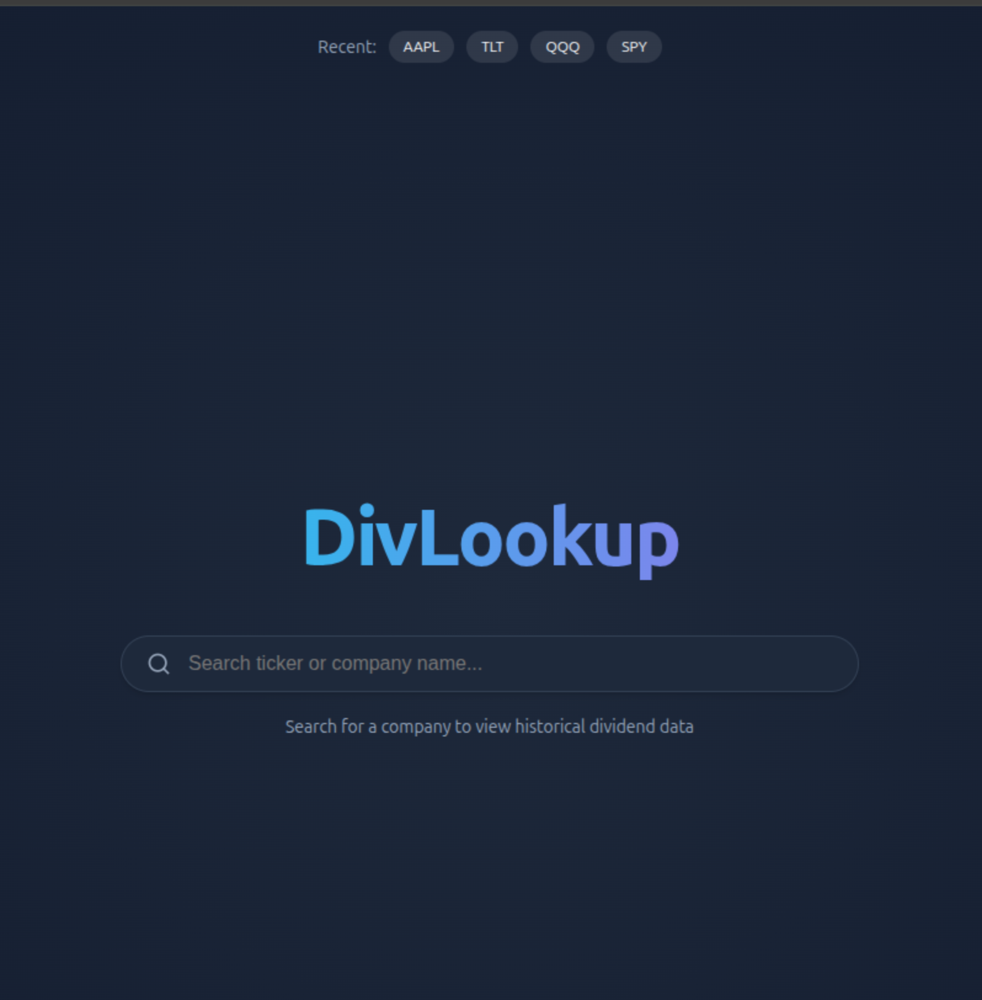
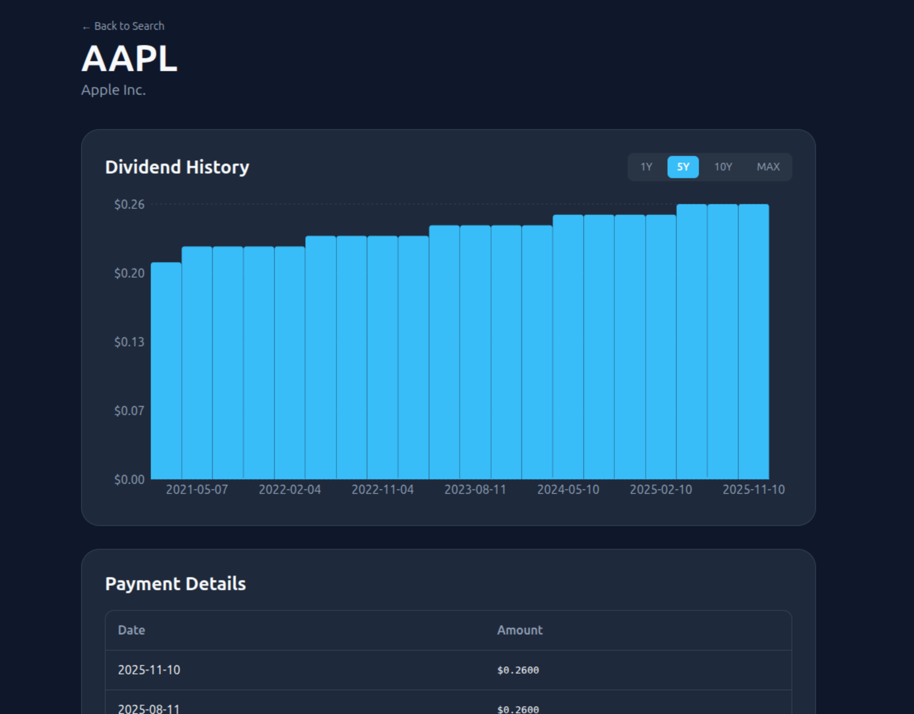

# DivLookup

A simple web app to lookup distribution history of companies and ETFs. Built off of [y-finance](https://github.com/ranaroussi/yfinance).

Live demo of it up (barring AWS costs 😄) at: http://divlookup.paulisbuildingstuff.com/



## Prerequisites

- Node.js (v18 or higher recommended)
- Python (v3.8 or higher recommended)

## How to run

```bash
# Backend setup
cd backend
python3 -m venv venv

#WINDOWS: venv\Scripts\activate
source venv/bin/activate
pip install -r requirements.txt
python app.py # Will run on port 5000

# Front-end setup
cd /to/div-lookup
npm install
npm run dev
```
